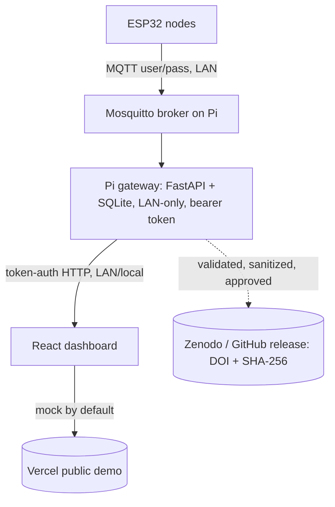

# MycoSense — System Architecture

> Status: Reference document — reflects current implementation (bench/pre-field)
> Last updated: 2026-06-29
> Owner: Carlos Garcia (President / Research Director)
> File: docs/architecture/mycosense-system-architecture.md
> Source repos: `luminis-foundation/mycosense` (`pi-server/main.py`, `esp32-firmware/`, `src/`),
> `mycosense/SECURITY.md`, `mycosense/FIELD_STATUS.md`, `mycosense/docs/FIELD_DEPLOYMENT_SECURITY.md`

---

## Purpose

A single architecture reference for the MycoSense ecological sensing platform: the components, the data path,
trust boundaries, and the current security gaps. It grounds ADR 0002
(`docs/adr/0002-local-first-field-data-architecture.md`) and the Data Security Policy
(`research/data-security-policy.md`).

---

## Components

| Component | Tech | Location / exposure | Role |
|---|---|---|---|
| ESP32 field nodes | C++ firmware (`esp32-firmware/`) | LAN hotspot only | Capture raw ADC from electrode arrays; publish via MQTT |
| MQTT broker | Mosquitto | Pi, LAN only (port 1883, bound to hotspot IP) | Transport between nodes and gateway; username/password auth |
| Pi gateway | Python FastAPI + SQLite (`pi-server/main.py`) | Pi, LAN interface IP, port 8765 — **not internet-routable** | Ingest readings; store locally; serve dashboard via token-auth API |
| Dashboard | React 18 + Vite (`src/`) | Vercel (public, mock by default) / local trusted build (live mode) | Visualize data; CSV export; calibration/provenance UI |
| Public release target | Zenodo / GitHub | Public | Validated, sanitized dataset releases with DOI + SHA-256 manifest |

---

## Data Path (text diagram)

```text
[ESP32 node]  --MQTT (user/pass, LAN hotspot)-->  [Mosquitto broker on Pi]
     |                                                     |
  raw ADC, NTP-synced ts                                   v
                                            [Pi gateway: FastAPI + SQLite]
                                            - binds to LAN IP (not 0.0.0.0)
                                            - bearer-token auth on all endpoints
                                            - CORS restricted; batch/query caps
                                                     |
                              token-auth HTTP (LAN / trusted local build)
                                                     v
                                          [React dashboard]
                                          - Vercel = MOCK mode (public)
                                          - local trusted build = LIVE mode
                                                     |
                            deliberate, reviewed, sanitized release
                                                     v
                                   [Zenodo / GitHub: DOI + manifest]
```

Mermaid (optional rendering):



---

## Trust Boundaries

1. **Internet ↔ Vercel dashboard:** public, but **mock data only** — no real sensor data crosses this
   boundary by default.
2. **Internet ↔ Pi gateway:** **must not exist.** The Pi binds to the LAN interface and is never
   port-forwarded (`risk/attack-surface-analysis.md` #6).
3. **LAN hotspot (nodes ↔ Pi):** trusted-perimeter today; authenticated (MQTT user/pass, bearer token) but
   **not yet TLS-encrypted or message-signed**.
4. **Private archive ↔ everything else:** raw data lives on encrypted offline drives; only sanitized,
   approved outputs leave it.

---

## Authentication & Limits (current)

- Pi API: bearer token (`MYCOSENSE_API_TOKEN`) on all endpoints; CORS restricted to explicit origins.
- Batch cap: 200 readings/POST; query cap: 5,000 rows.
- ESP32: credentials in NVS (not source); MQTT user/pass; NTP sync required before timestamps trusted.
- Dashboard: XSS-safe React rendering (no `dangerouslySetInnerHTML`); RFC 4180 CSV quoting; CSP + security
  headers (`vercel.json`).

---

## Current Gaps (close before field deployment)

From `mycosense/SECURITY.md`, `FIELD_STATUS.md`, and `research/data-security-policy.md` §6:

- Pi server has **no TLS** (cleartext tokens if ever exposed).
- MQTT messages are **not signed**; **no replay protection**.
- **No log rotation** on the Pi (disk-full risk on long deployments).
- **No documented network segmentation** policy.
- `VITE_PI_TOKEN` must **never** be set in the public Vercel build (would leak the token in the JS bundle).

---

## Current Status

Bench testing underway; full end-to-end (ESP32 → Pi → Dashboard) not yet field-validated. Controlled on-site
prototype deployment at Rowe, NM is planned (Step 3). See `mycosense/FIELD_STATUS.md` for the deployment
ladder.

---

## Related

- ADR 0002 — Local-First Field Data Architecture
- `research/data-management-plan.md` — data lifecycle and release
- `research/data-security-policy.md` — security requirements and gaps
- `operations/disaster-recovery-rto-rpo.md` — backup/recovery for the Pi database
